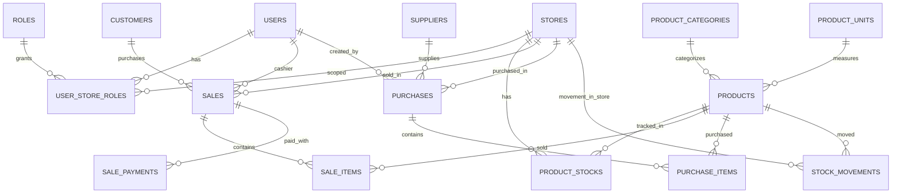

# Perancangan Sistem POS UMKM

Dokumen ini menjadi output tahap **Perancangan Sistem** untuk scope POS inti.

## ERD (Ringkas)

## Struktur Tabel (Scope Inti)
- `users`, `roles`, `user_store_roles`
- `stores`
- `products`, `product_categories`, `product_units`, `product_stocks`
- `customers`, `suppliers`
- `sales`, `sale_items`, `sale_payments`
- `purchases`, `purchase_items`
- `stock_movements`

## Flow Transaksi Penjualan
1. kasir memilih produk + qty
2. sistem validasi stok cukup
3. simpan `sales`
4. simpan `sale_items`
5. simpan `sale_payments` (jika selesai)
6. kurangi `product_stocks`
7. catat `stock_movements` tipe `sale`

## Flow Transaksi Pembelian
1. admin membuat transaksi pembelian (draft/ordered/received)
2. simpan `purchases`
3. simpan `purchase_items`
4. saat status `received`, tambah `product_stocks`
5. catat `stock_movements` tipe `purchase`

## Rancangan UI Per Halaman (Scope Inti)
- `/` : login/register
- `/dashboard` : ringkasan role-aware
- `/dashboard/admin` : dashboard admin
- `/dashboard/kasir` : dashboard kasir
- master data admin:
  - `/dashboard/admin/products`
  - `/dashboard/admin/product-categories`
  - `/dashboard/admin/product-units`
  - `/dashboard/admin/customers`
  - `/dashboard/admin/suppliers`
- transaksi:
  - `/dashboard/transaksi/tambah`
  - `/dashboard/admin/sales`
  - `/dashboard/admin/purchases`
- stok & laporan:
  - `/dashboard/admin/inventory`
  - `/dashboard/admin/reports`

## Struktur Folder Proyek (Ringkas)
- `src/app` : routing halaman dan API routes
- `src/components` : komponen UI per domain
- `src/lib` : auth, supabase client, util bisnis
- `src/types` : tipe entity/form/view
- `supabase/migrations` : skema database

## Daftar Endpoint API (Ringkas)
- autentikasi:
  - `POST /api/login`
  - `POST /api/logout`
  - `POST /api/users` (register)
- admin master data:
  - `/api/admin/products`
  - `/api/admin/product-categories`
  - `/api/admin/product-units`
  - `/api/admin/customers`
  - `/api/admin/suppliers`
  - `/api/admin/stores`
- admin transaksi:
  - `/api/admin/sales`
  - `/api/admin/purchases`
  - `/api/admin/sales/[saleId]/items`
  - `/api/admin/purchases/[purchaseId]/items`
- kasir transaksi:
  - `GET /api/kasir/transaction-options`
  - `POST /api/kasir/transactions`
- inventori:
  - `/api/admin/inventory/stocks`
  - `/api/admin/inventory/movements`
  - `/api/admin/inventory/adjustments`
- laporan:
  - `/api/admin/reports/sales`
  - `/api/admin/reports/stocks`
  - `/api/admin/reports/purchases`
  - `/api/admin/reports/profit`
  - `/api/admin/reports/cash`

